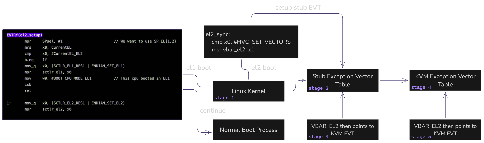
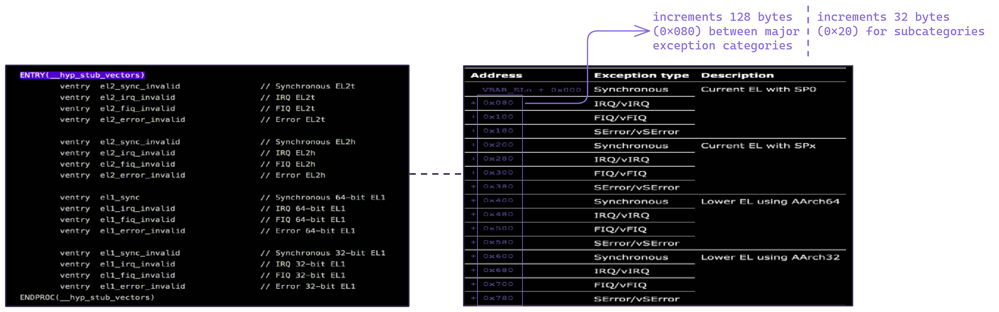

**Kvmrsk** is a <a href="https://www.rust-lang.org">rust</a> re-write of *0xwillow*/3intermute's PoC implementation for <a href="https://i.blackhat.com/us-18/Wed-August-8/us-18-SINGH-BACK-TO-THE-FUTURE-A-RADICAL-INSECURE-DESIGN-OF-KVM-ON-ARM-wp.pdf">Singhs paper on KVM's insecure design on ARM</a>. This repository is a WIP and will not be actively maintained, rather I will dump commits every few days/weeks, because I'm naturally lazy. Then I'll archive it when I think it is done.

### Here are a few recreational and perhaps insightful diagrams based on Singhs paper:

boot level checking, stub EVT & kvm EVT initialisation 

and (stub vector table layout)
